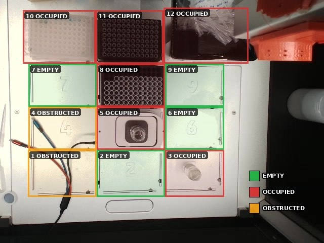

# Opentrons Vision Validation

## Goal

Prevent Opentrons OT-2 runs from starting with the wrong physical deck setup. Before any BEARS PUDA workflow executes a physical Opentrons run, capture a fresh deck image, verify the slots used by the protocol, identify visible labware/items, and stop for user confirmation when anything is uncertain or mismatched.

This is a **physical safety gate**. PUDA protocol validation checks command structure; it does not prove the robot deck contains the expected labware.

## When to Use

Use this skill before running any Opentrons protocol that depends on deck setup, including:

- liquid transfer, mixing, aspiration, dispense, or plate workflows
- protocols with tipracks, source plates, destination plates, reservoirs, vials, or modules
- colour-mixing or viscosity workflows that generate/run OT-2 protocols
- any user request that names deck slots or labware placement

Do not use it as a substitute for Opentrons protocol validation. Use both: validate protocol structure first, then visually validate physical setup before robot execution.

## Critical Rule

Before any physical Opentrons run, perform a **vision validation gate**:

1. Extract the expected deck map from the user request and protocol.
2. Capture a fresh image of the OT-2 deck.
3. Inspect every slot used by the protocol.
4. Identify occupied slots and visible labware/items.
5. Compare expected vs observed deck setup.
6. Ask the user to confirm uncertain labware or any mismatch.
7. Do **not** execute robot motion until the visual check passes or the user explicitly approves proceeding despite the risk.

If exact labware identity is unclear from the image, **ask the user**. Do not guess exact Opentrons labware definitions from appearance alone.

## OT-2 Deck Slot Layout

Use the standard OT-2 deck layout:

| Row | Slots |
|---|---|
| Back | 10, 11, 12 |
| Middle | 7, 8, 9 |
| Front/middle | 4, 5, 6 |
| Front | 1, 2, 3 |

Vertical relationships:

- Slot **10** is above slot **7**.
- Slot **11** is above slot **8**.
- Slot **12** is above slot **9**.

If a slot is outside the camera view or obscured, mark it `not visible` or `obscured`. Do not infer occupancy from neighbouring slots.

## Example Annotated Deck Image

Use this image as the preferred presentation example for a full-deck occupancy check:



Asset path: `assets/ot2-deck-slot-occupancy-example.jpg`

Presentation conventions shown in the example:

- Draw a separate rectangle around each standard deck slot, numbered **1–12**.
- Follow the physical layout exactly: front `1–3`, then `4–6`, `7–9`, and back `10–12`.
- Put the slot number and status in a high-contrast label at the top-left of each rectangle.
- Use **green** for `EMPTY`, **red** for `OCCUPIED`, and **orange** for `OBSTRUCTED`.
- Include an on-image legend using the same colours.
- Keep the underlying labware visible with transparent or outline-only rectangles.
- Use `OBSTRUCTED`, rather than `EMPTY`, when cables or other objects prevent a confident check.

When returning the result to the user, attach the annotated image and include concise occupied, empty, obstructed, and not-visible slot lists.

## Vision Validation Workflow

### 1. Extract the Expected Deck Map

List every slot used by the planned Opentrons run:

| Slot | Expected labware/item | Role |
|---|---|---|
| 8 | 300 µL tiprack | tips |
| 3 | mixing plate | destination |

Completion criterion: every slot the protocol will use has an expected item, and any required-empty slots are explicitly listed.

### 2. Capture a Fresh Deck Image

Prefer the `opentrons` machine `capture_image` command when available:

```bash
puda machine commands opentrons
# create/run a one-command protocol:
# name: capture_image
# machine_id: opentrons
# params.filename: opentrons-vision-<UTC timestamp>.jpg
```

If PUDA capture fails with `No camera configured. Pass camera_index when constructing Opentrons.`, use the configured BEARS RTSP fallback without restarting edge services:

```bash
mkdir -p /home/opentron/temp_opentrons/captures /tmp/puda-latest-images
ffmpeg -y -rtsp_transport tcp -i rtsp://100.102.45.58:8554/cam0 \
  -frames:v 1 -q:v 2 /home/opentron/temp_opentrons/captures/<filename>.jpg
cp /home/opentron/temp_opentrons/captures/<filename>.jpg /tmp/puda-latest-images/<unique-copy>.jpg
stat -c '%n %s bytes %y' /tmp/puda-latest-images/<unique-copy>.jpg
sha256sum /tmp/puda-latest-images/<unique-copy>.jpg
```

Completion criterion: a new image file exists, has non-zero size, and its path/hash are recorded.

### 3. Inspect and Identify the Image Conservatively

Before assigning an exact labware identity, consult the live [Opentrons Labware Library](https://labware.opentrons.com/) and follow [the visual-identification reference](references/opentrons-labware-library-visual-identification.md). Compare the slot crop with official candidates from the correct category, report the official display name and API load name when supported, and distinguish OT-2 labware from Flex labware. Do not rely on colour alone.

For each expected slot, report:

- whether the slot is visible
- whether the slot is occupied
- visible labware/item description
- confidence: high, medium, or low

Also report any unexpected occupied or obstructed slot that could affect the run.

Use conservative language:

- `appears to be a 300 µL tiprack` is acceptable when visually likely but not certain.
- `black multi-well rack/plate; please confirm exact labware` is better than guessing.
- `not visible` or `obscured` is better than assuming.

Completion criterion: there is a slot-by-slot observation table for all expected slots plus any unexpected occupied/obstructed slots.

### 4. Compare Expected vs Observed

Use this status table:

| Slot | Expected | Observed | Status |
|---|---|---|---|
| 8 | 300 µL tiprack | appears to be 300 µL tiprack | OK / needs confirmation |
| 3 | mixing plate | glass vial | MISMATCH |

Status values:

- `OK` — expected slot is occupied by the expected labware/item with high confidence.
- `needs confirmation` — slot is occupied but exact labware identity is uncertain.
- `MISMATCH` — observed item differs from expected, expected slot is empty, or unexpected item blocks a required empty slot.
- `not visible` — camera cannot verify.

Completion criterion: every protocol slot has one status.

### 5. Gate Execution

- If every required slot is `OK`, continue with the normal PUDA Opentrons run workflow.
- If any slot is `needs confirmation`, ask the user to confirm before running.
- If any slot is `MISMATCH` or `not visible`, do not run. Ask the user whether to correct/reposition the deck or explicitly approve proceeding despite the risk.
- If the user corrects labware identity or slot occupancy, update the current run's deck map and re-check the protocol against it.
- If the correction changes the required setup, patch or regenerate the protocol and re-validate before running.

Completion criterion: the user's approval/correction is recorded before any physical robot execution.

## Example

User asks for a liquid transfer using Opentrons with:

- 300 µL tiprack on slot 8
- mixing plate on slot 3

Expected deck map:

| Slot | Expected item | Role |
|---|---|---|
| 8 | 300 µL tiprack | tips |
| 3 | mixing plate | source/destination |

Required pre-run check:

1. Capture a fresh deck image.
2. Inspect slot 8 and slot 3.
3. Report the comparison:

| Slot | Expected | Observed | Status |
|---|---|---|---|
| 8 | 300 µL tiprack | appears to be 300 µL tiprack | OK |
| 3 | mixing plate | glass vial | MISMATCH |

4. Stop and ask the user to confirm/correct slot 3 before executing the transfer.

## Known Setup Conventions

- On the user's BEARS OT-2 setup, **slot 12 contains the standard Opentrons trash bin**. Treat it as an expected fixed deck item, not as an unexpected obstruction. Report it as `Opentrons trash bin (expected)` unless the image shows a materially different object or the bin interferes with another required item.

## Current-Run Evidence Policy

Each vision validation must be independent. Determine the result from:

1. the **current user-provided expected deck map**,
2. a **fresh image captured for this validation**, and
3. the labware-identification guidance and official Opentrons Labware Library references stored in this skill.

Do **not** use a labware identity or slot assignment confirmed in an earlier validation as evidence for the current image. Deck contents may have changed between captures. Earlier user corrections may improve general inspection technique, but they must not determine the current result. If the fresh image cannot distinguish 300 µL from 1000 µL tips or one plate definition from another, report `needs confirmation` rather than importing the identity from a previous run.

The only standing setup convention is the standard Opentrons trash bin in slot 12; even this must still be visibly present in the fresh image.

## Common Pitfalls

- **Misclassifying the slot 12 trash bin.** On the user's BEARS OT-2 setup, the item in slot 12 is the expected Opentrons trash bin; do not label it `OBSTRUCTED` merely because it occupies the slot.
- **Guessing labware from appearance.** Ask the user when exact labware identity is uncertain.
- **Carrying earlier confirmations into a fresh validation.** Never treat a labware identity or slot assignment from a previous capture as evidence for the current capture. Re-identify from the current request, fresh image, and skill/library references.
- **Ignoring corrections within the current validation.** If the user corrects a slot or identity for the current fresh image, incorporate it only into that validation; do not persist it as evidence for future captures.
- **Forgetting back-row slots.** Slot 10 is above 7, slot 11 above 8, and slot 12 above 9.
- **Mistaking artifacts for occupancy.** Transparent lids, reflections, cables, and neighbouring labware can look like slot occupation.
- **Running after a mismatch.** Stop until the user corrects the deck or explicitly approves proceeding.
- **Treating `puda protocol validate` as physical validation.** It is not; vision validation is separate.

## Verification Checklist

- [ ] Expected deck map extracted from the user request/protocol.
- [ ] Fresh deck image captured and verified with path/size/hash.
- [ ] Exact labware candidates compared against the live Opentrons Labware Library when identification is required.
- [ ] Result based only on the current expected deck map, fresh image, and skill/library references—not prior validation confirmations.
- [ ] Official display name/API load name and confidence reported, or ambiguity explicitly marked.
- [ ] Every expected slot inspected.
- [ ] Unexpected occupied/obstructed slots reported.
- [ ] Expected-vs-observed table produced.
- [ ] User asked to confirm uncertain or mismatched labware.
- [ ] Robot execution only proceeds after visual validation passes or user explicitly approves.
